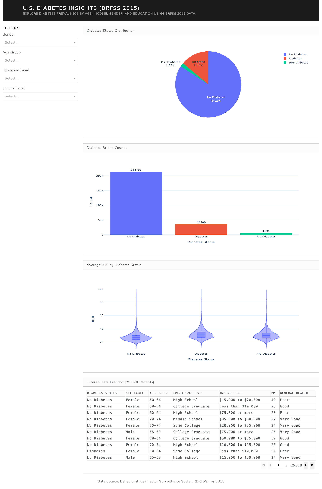
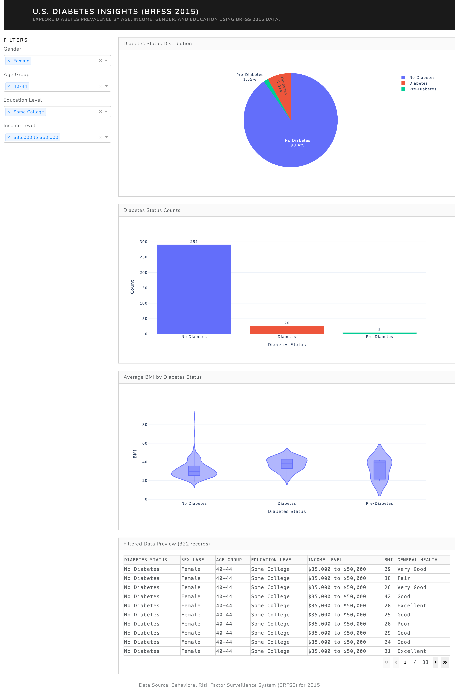
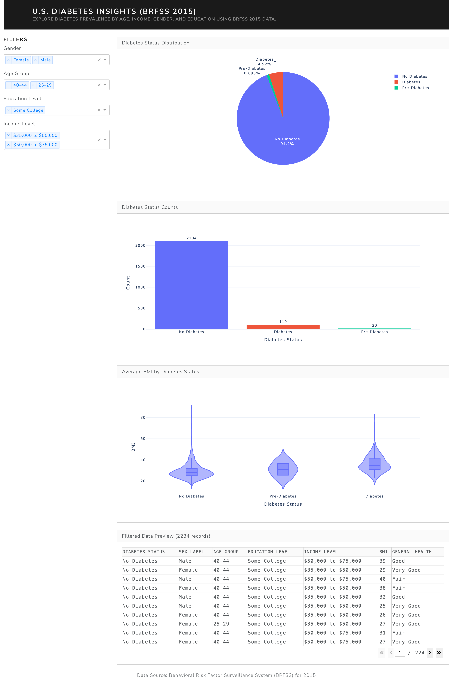

# 🩺 Diabetes Prevalence Dashboard

This project presents an interactive data visualization dashboard that explores the prevalence of diabetes across demographic and health-related factors in the United States. It was created as part of a Data Visualisation course and focuses on transforming a health dataset into a user-friendly, informative dashboard.

## 📊 Overview

The dashboard was built using the Behavioral Risk Factor Surveillance System (BRFSS 2015) dataset. It includes demographic, behavioral, and health-related variables to analyze patterns in diabetes prevalence.

The dashboard allows users to:

- Explore diabetes prevalence by gender, age group, education and income
- Compare regional and lifestyle-related factors
- Identify trends and potential correlations visually

## 🧩 Design and Visual Storytelling

This dashboard focuses on clear layout and direct interaction, avoiding overcomplicated visuals. Key design choices include:

- Bar charts and grouped comparisons to highlight categorical differences
- Filtering by age and gender to allow comparison between key subgroups
- Contrasting colors for diabetic vs non-diabetic groups
- Focused tooltips and simple axis labeling for clarity

The user experience is designed to surface trends quickly — such as higher prevalence in lower-income brackets, or gender-related differences across age groups.

## 🧪 Dataset

The project uses a cleaned version of the 2015 BRFSS dataset, prepared for visualization.

- Source: [CDC BRFSS 2015](https://www.cdc.gov/brfss/annual_data/annual_2015.html)
- The data is stored locally in `data/brfss_2015_cleaned.csv`


## 🚀 Getting Started

1. Clone the repository:

```bash
git clone https://github.com/wiederstrom/Diabetes-Dashboard.git
cd Diabetes-Dashboard
```

### 2. (Optional) Create and activate a virtual environment

```bash
python3 -m venv venv
source venv/bin/activate
```

### 3. Install dependencies

```bash
pip install -r requirements.txt
```

### 4. Run the app

```bash
python app.py
```

5. Open your browser and visit: `http://127.0.0.1:8050`

## 📸 Screenshot






## 📁 Folder Structure

```
Diabetes-Dashboard/
├── app.py                 # Main Dash app
├── requirements.txt       # Python dependencies
├── .gitignore             # Exclude temp & system files
├── README.md              # This file
├── data/
│   └── gldiabetes_012_health_indicators_BRFSS2015.csv   # Cleaned dataset
├── screenshots/
│   └── screenshot1.png
    └── creenshot2.png 
    └── creenshot3.png 
```

## ✍️ Author

**Erik Lunde Wiederstrøm**\
Bachelor in Applied Data Science, 2025\
[LinkedIn](https://linkedin.com/in/wiederstrom)
